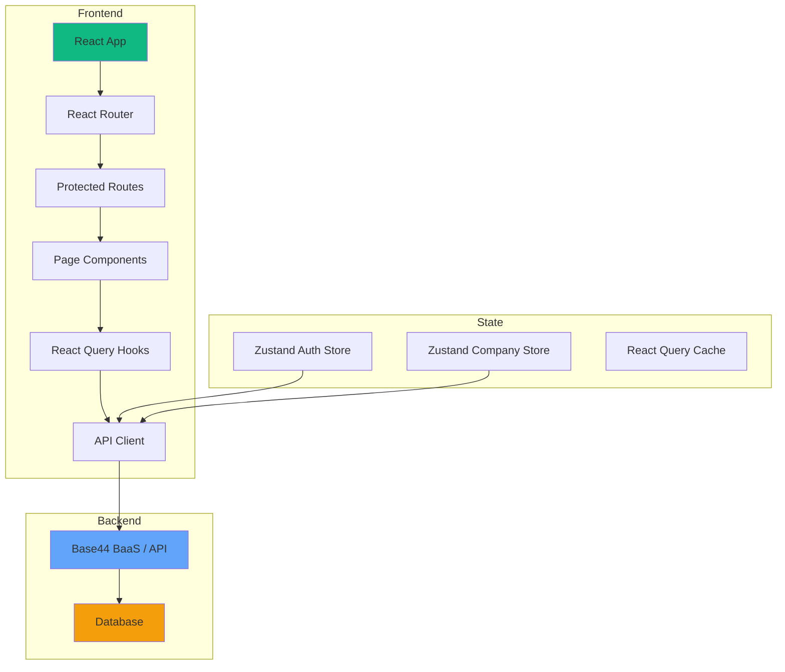
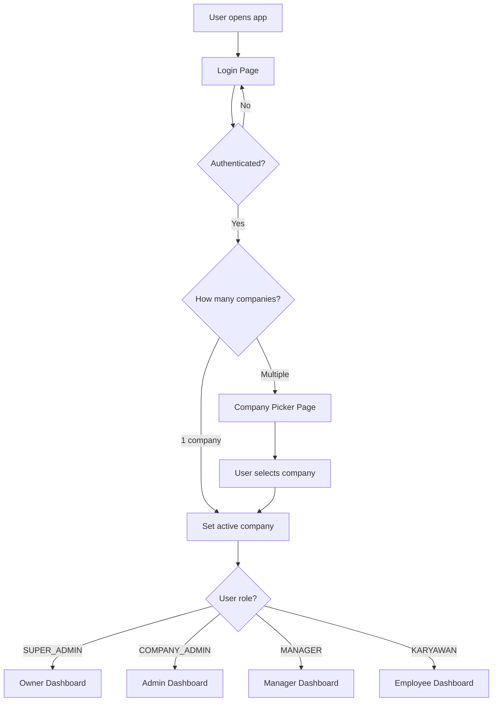
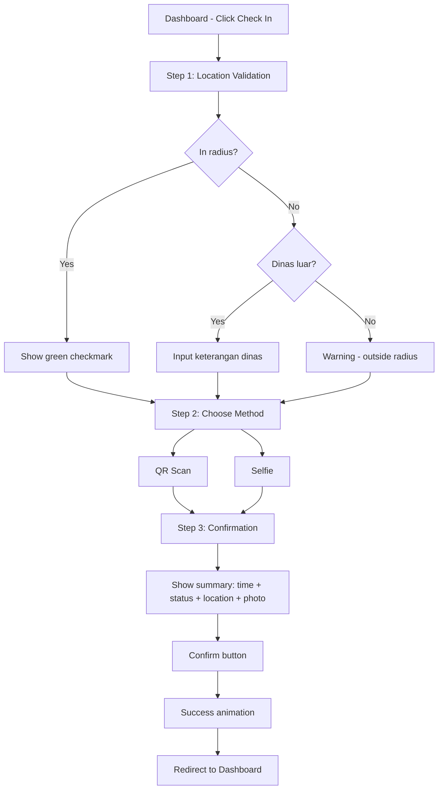

# Implementation Plan — Attendance & Payroll System v2.0

## Project Architecture

### Tech Stack
- **Frontend:** React 18 + Vite + TypeScript
- **Styling:** Tailwind CSS 3.4 + shadcn/ui components
- **State Management:** TanStack React Query + Zustand (for local state like active company)
- **Routing:** React Router v6
- **Charts:** Recharts
- **Date Handling:** date-fns (replacing moment.js for smaller bundle)
- **Icons:** Lucide React
- **Animations:** Framer Motion
- **PDF:** react-pdf / @react-pdf/renderer
- **Date Picker:** react-date-range
- **Backend:** Base44 BaaS (existing) — or Supabase/Firebase if migrating

### Project Structure

```
src/
├── app/
│   ├── App.tsx                    # Root component
│   ├── routes.tsx                 # Route definitions
│   └── providers.tsx              # All context providers wrapped
├── assets/
│   ├── illustrations/            # Empty state SVGs
│   └── logos/                    # Company logos
├── components/
│   ├── ui/                       # shadcn/ui base components
│   ├── layout/
│   │   ├── AppLayout.tsx         # Main layout wrapper
│   │   ├── Sidebar.tsx           # Desktop sidebar
│   │   ├── BottomNav.tsx         # Mobile bottom navigation
│   │   ├── Header.tsx            # Top bar with notifications + avatar
│   │   └── CompanySwitcher.tsx   # Company switch in header
│   ├── common/
│   │   ├── StatusBadge.tsx       # Unified status badge (soft colors)
│   │   ├── EmptyState.tsx        # Illustrated empty states
│   │   ├── SkeletonLoader.tsx    # Skeleton loading states
│   │   ├── PageHeader.tsx        # Consistent page headers
│   │   ├── DataTable.tsx         # Responsive table with toggle columns
│   │   ├── StepIndicator.tsx     # Multi-step wizard indicator
│   │   └── ConfirmModal.tsx      # Reusable confirmation modal
│   ├── attendance/
│   │   ├── CheckInWizard.tsx     # 3-step check-in flow
│   │   ├── AttendanceCard.tsx    # Daily attendance summary card
│   │   ├── AttendanceHeatmap.tsx # Heatmap visualization
│   │   └── LocationValidator.tsx # GPS validation component
│   ├── payroll/
│   │   ├── PayrollPreview.tsx    # Preview modal before generate
│   │   ├── PayslipCard.tsx       # Individual payslip display
│   │   └── PayslipPDF.tsx        # PDF template for payslip
│   ├── notifications/
│   │   ├── NotificationBell.tsx  # Bell with grouped notifications
│   │   ├── NotificationItem.tsx  # Single notification row
│   │   └── NotificationPanel.tsx # Dropdown panel
│   └── charts/
│       ├── AttendanceChart.tsx
│       ├── PayrollChart.tsx
│       └── TrendLineChart.tsx
├── pages/
│   ├── auth/
│   │   ├── LoginPage.tsx
│   │   └── CompanyPickerPage.tsx
│   ├── owner/
│   │   ├── OwnerDashboard.tsx
│   │   └── CompanyManagement.tsx
│   ├── dashboard/
│   │   ├── EmployeeDashboard.tsx
│   │   └── ManagerDashboard.tsx
│   ├── attendance/
│   │   ├── CheckInPage.tsx
│   │   └── MyHistoryPage.tsx      # Merged: attendance + leave + overtime
│   ├── requests/
│   │   ├── MyRequestsPage.tsx     # All requests in one place
│   │   ├── LeaveRequestForm.tsx
│   │   ├── OvertimeRequestForm.tsx
│   │   └── CorrectionRequestForm.tsx
│   ├── management/
│   │   ├── LeaveApprovalPage.tsx
│   │   ├── OvertimeApprovalPage.tsx
│   │   ├── CorrectionApprovalPage.tsx
│   │   └── EmployeeManagement.tsx
│   ├── payroll/
│   │   ├── PayrollPage.tsx
│   │   ├── PayslipViewPage.tsx
│   │   └── PayrollHistoryPage.tsx
│   ├── analytics/
│   │   └── AnalyticsDashboard.tsx
│   ├── settings/
│   │   └── SettingsPage.tsx       # Unified: Company + Payroll + Overtime + Notifications
│   └── self-service/
│       └── SelfServicePortal.tsx
├── hooks/
│   ├── useAuth.ts                # Authentication hook
│   ├── useCompany.ts             # Active company context
│   ├── useAttendance.ts          # Attendance queries
│   ├── usePayroll.ts             # Payroll queries
│   ├── useNotifications.ts       # Notification queries
│   └── usePermissions.ts         # Role-based access control
├── lib/
│   ├── api/
│   │   ├── client.ts             # API client with company_id injection
│   │   ├── auth.ts               # Auth API calls
│   │   ├── companies.ts          # Company CRUD
│   │   ├── employees.ts          # Employee CRUD
│   │   ├── attendance.ts         # Attendance API
│   │   ├── leave.ts              # Leave API
│   │   ├── payroll.ts            # Payroll API
│   │   └── notifications.ts     # Notifications API
│   ├── utils/
│   │   ├── date.ts              # Date formatting utilities
│   │   ├── currency.ts          # IDR formatting
│   │   ├── permissions.ts       # Permission check helpers
│   │   └── validators.ts        # Form validation schemas
│   └── constants/
│       ├── roles.ts             # Role definitions
│       ├── status.ts            # Status enums
│       └── routes.ts            # Route path constants
├── stores/
│   ├── authStore.ts             # Zustand: auth state
│   ├── companyStore.ts          # Zustand: active company
│   └── uiStore.ts              # Zustand: sidebar, theme, etc.
├── styles/
│   ├── globals.css              # CSS variables (design tokens)
│   └── tailwind.css             # Tailwind directives
└── types/
    ├── company.ts
    ├── employee.ts
    ├── attendance.ts
    ├── leave.ts
    ├── payroll.ts
    ├── overtime.ts
    ├── notification.ts
    └── common.ts
```

---

## Route Map

```
/login                    → LoginPage
/pick-company             → CompanyPickerPage
/owner                    → OwnerDashboard (SUPER_ADMIN only)
/owner/companies          → CompanyManagement (SUPER_ADMIN only)
/dashboard                → EmployeeDashboard / ManagerDashboard (role-based)
/check-in                 → CheckInPage
/my-history               → MyHistoryPage (tabs: Attendance/Leave/Overtime/Correction)
/my-requests              → MyRequestsPage (tabs: All/Leave/Overtime/Correction)
/my-requests/leave/new    → LeaveRequestForm
/my-requests/overtime/new → OvertimeRequestForm
/my-requests/correction/new → CorrectionRequestForm
/approvals/leave          → LeaveApprovalPage (MANAGER/ADMIN)
/approvals/overtime       → OvertimeApprovalPage (MANAGER/ADMIN)
/approvals/correction     → CorrectionApprovalPage (MANAGER/ADMIN)
/employees                → EmployeeManagement (ADMIN)
/payroll                  → PayrollPage (ADMIN)
/payroll/history          → PayrollHistoryPage (ADMIN)
/payslip/:id              → PayslipViewPage (Employee/Admin)
/analytics                → AnalyticsDashboard (MANAGER/ADMIN)
/settings                 → SettingsPage (ADMIN) — tabs: Company/Payroll/Overtime/Notifications
/self-service             → SelfServicePortal (Employee)
```

---

## Database Entities (TypeScript Types)

```typescript
// Company
interface Company {
  id: string;
  name: string;
  slug: string;
  logo_url: string;
  industry: string;
  address: string;
  npwp: string;
  is_active: boolean;
  owner_email: string;
  subscription_plan: 'BASIC' | 'PRO' | 'ENTERPRISE';
  max_employees: number;
  created_at: Date;
  updated_at: Date;
}

// Employee (with company_id)
interface Employee {
  id: string;
  company_id: string;
  user_email: string;
  employee_id: string;
  full_name: string;
  phone: string;
  position: string;
  department: string;
  team_id: string;
  role: 'SUPER_ADMIN' | 'COMPANY_ADMIN' | 'MANAGER' | 'KARYAWAN';
  join_date: Date;
  photo_url: string;
  is_active: boolean;
  created_at: Date;
}

// Attendance (with company_id)
interface Attendance {
  id: string;
  company_id: string;
  employee_id: string;
  date: string; // YYYY-MM-DD
  check_in_time: string;
  check_out_time: string;
  status: AttendanceStatus;
  check_in_method: 'QR' | 'SELFIE' | 'FACE' | 'MANUAL';
  check_in_location: GeoPoint;
  check_out_location: GeoPoint;
  check_in_photo_url: string;
  notes: string;
  is_auto_checkout: boolean;
  overtime_minutes: number;
  late_minutes: number;
  early_leave_minutes: number;
}

type AttendanceStatus = 
  | 'HADIR' 
  | 'TERLAMBAT' 
  | 'PULANG_CEPAT'
  | 'IZIN' 
  | 'SAKIT' 
  | 'CUTI' 
  | 'DINAS_LUAR'
  | 'TIDAK_HADIR' 
  | 'AUTO_CHECKOUT'
  | 'LIBUR';
```

---

## Implementation Phases (Detailed)

### Phase 1A: Project Scaffolding
1. Initialize Vite + React + TypeScript project
2. Install dependencies: tailwindcss, shadcn/ui, react-router, tanstack-query, zustand, lucide-react, framer-motion, recharts, date-fns
3. Configure Tailwind with custom design tokens
4. Setup shadcn/ui components (button, card, dialog, tabs, etc.)
5. Create folder structure as defined above

### Phase 1B: Design System
1. Define CSS variables in `globals.css` (all color tokens from PRD Section 8)
2. Configure Tailwind `extend` with custom colors
3. Create `StatusBadge` component with soft color mapping
4. Setup dark mode toggle (class-based)
5. Typography setup (Inter font, sizes)

### Phase 1C: Database & API Layer
1. Define all TypeScript interfaces in `/types/`
2. Create mock data for development
3. Setup API client with automatic `company_id` injection
4. Create all API modules (companies, employees, attendance, etc.)
5. Setup React Query hooks for each entity

### Phase 1D: Auth + Multi-Company
1. Login page (email + password)
2. Auth store (Zustand) — token, user info, active company
3. Company Picker page — shown when user belongs to >1 company
4. Protected route wrapper with role checks
5. Company context provider — all child components get `company_id`

### Phase 1E: Layout & Navigation
1. `AppLayout` — responsive shell
2. `Sidebar` — collapsible, role-based menu items
3. `BottomNav` — mobile only, 5 key actions
4. `Header` — company switcher, notifications bell, avatar menu
5. Dark mode implementation (CSS variables swap)
6. Page transition animations (framer-motion)

### Phase 1F-1P: Feature Pages
Each page follows the same pattern:
1. Page component with proper loading/empty states
2. Connected to React Query hooks
3. Responsive design (mobile-first)
4. Role-based visibility
5. Proper error handling

---

## Key Architecture Decisions

### Multi-Tenant Data Isolation
- Every API call automatically includes `company_id` from the active company store
- The API client interceptor adds `company_id` to all requests
- Backend validates that the requesting user has access to that company
- SUPER_ADMIN can bypass company filter for cross-company views

### State Management Strategy
- **Server state:** TanStack React Query (caching, refetching, optimistic updates)
- **Client state:** Zustand stores (auth, active company, UI preferences)
- **Form state:** React Hook Form + Zod validation

### Component Design Principles
- All components use shadcn/ui as base
- Custom components extend shadcn primitives
- Consistent prop patterns: `variant`, `size`, `className`
- All interactive elements have loading + disabled states

---

## Mermaid: System Architecture



## Mermaid: Login Flow



## Mermaid: Check-In Flow



---

## Migration Strategy (Existing Data)

Since the workspace is currently empty, we are building from scratch. However, if there is existing data from v1:

1. Create a migration script that assigns all existing records `company_id = 'default_company'`
2. Create the default Company entity for the existing business
3. All existing users get mapped to this default company
4. New companies can be added after migration

---

## Estimated File Count
- ~50 component files
- ~15 page files
- ~10 hook files
- ~10 API/lib files
- ~10 type definition files
- ~5 store files
- ~5 config files
- **Total: ~105 files**

This is a large project. Implementation will be done in Code mode, starting with scaffolding and progressively building each feature.
